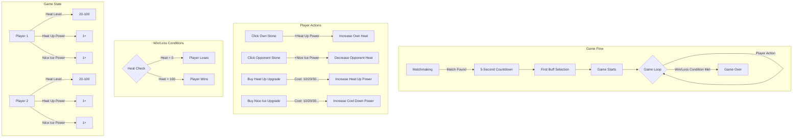

# Heatstone Game Mechanics Diagram

## Game Implementation Approach

### 1. Game UI Components

We'll need to create the following UI components:

1. **Game Field**:
   - Two interactive stone elements (egg-shaped)
   - Heat level displays for both players
   - Player names and stats

2. **Upgrade Panel**:
   - "Heat Up" button with cost display
   - "Nice Ice" button with cost display
   - Current upgrade levels for each

3. **Game Info**:
   - Countdown timer for game start
   - Game phase indicator
   - Action history or log

4. **Initial Buff Selection Screen**:
   - Modal overlay at game start
   - Two options: Heat Up or Nice Ice
   - Brief explanation of each

### 2. Game Logic Implementation

The core game logic will include:

1. **Heat Management**:
   - Track heat levels for both players
   - Handle heat increase/decrease based on player actions
   - Apply upgrade effects to actions

2. **Upgrade System**:
   - Track upgrade levels for both players
   - Calculate costs for upgrades (10, 20, 30...)
   - Apply upgrade effects to actions

3. **Win/Loss Detection**:
   - Check heat levels after each action
   - Trigger game over when conditions are met

4. **Game Flow Control**:
   - 5-second countdown at start
   - Initial buff selection phase
   - Main gameplay phase
   - Game over phase

### 3. Socket.io Integration

To make the game work in real-time:

1. **Game State Synchronization**:
   - Send player actions to server
   - Broadcast updated game state to both players
   - Handle disconnections and reconnections

2. **Action Validation**:
   - Validate actions on the server
   - Prevent cheating or invalid actions
   - Ensure game state consistency

3. **Room Management**:
   - Create game rooms for matched players
   - Track game state for each room
   - Clean up rooms when games end

### 4. Implementation Steps

1. Create the game UI components
2. Implement local game logic
3. Connect UI to Socket.io events
4. Test with multiple clients
5. Refine and balance gameplay