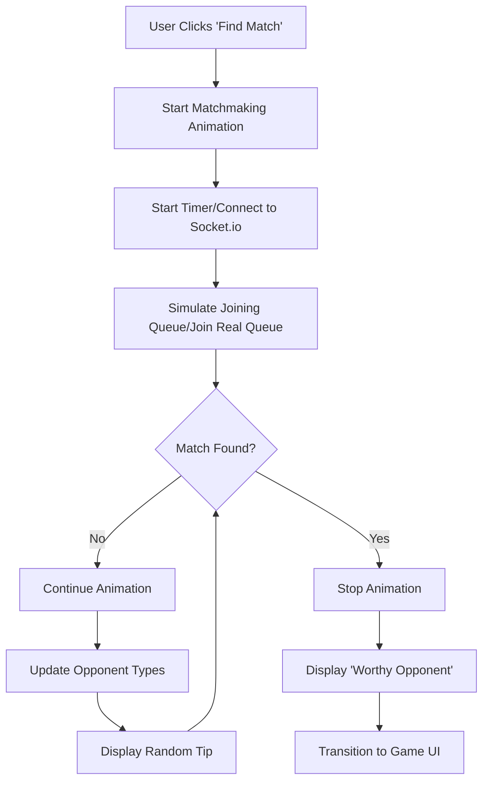
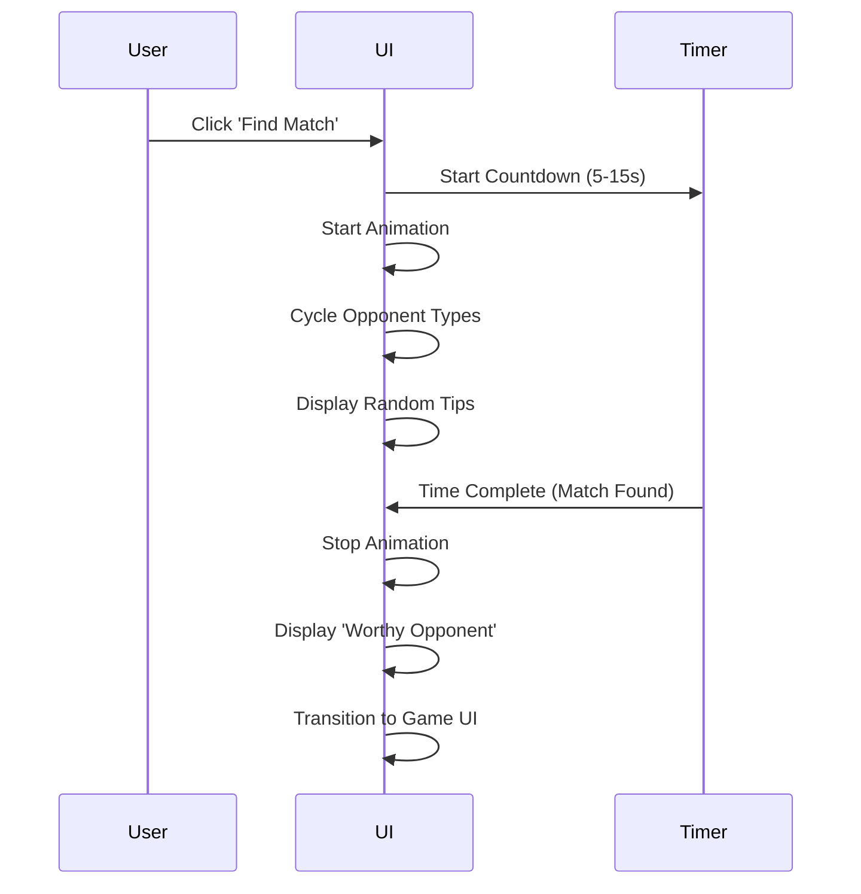
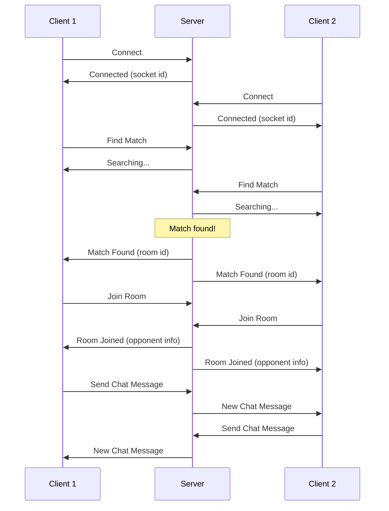

# Hearthstone-Inspired Matchmaking MVP - Implementation Plan

## Project Overview

We'll create a minimal fullstack application that mimics the Hearthstone matchmaking UI with:
- A 3D-ish spinning list of opponent types during matchmaking
- Loading tips display
- "Worthy opponent" when matched
- Basic room creation for two users
- Simple game UI after matching (player names and chat)

## Tech Stack

- **Frontend**: HTML, CSS, JavaScript
- **Real-time Communication**: Socket.io (Phase 2)
- **Backend**: Node.js with Express (Phase 2)
- **Initial Deployment**: Local development
- **Future Deployment**: Linode, Vercel, Glitch, or Render

## Project Structure

```
heatstone/
├── public/                  # Static frontend files
│   ├── index.html           # Main HTML file
│   ├── css/                 # CSS styles
│   │   └── style.css        # Main stylesheet
│   ├── js/                  # Client-side JavaScript
│   │   ├── main.js          # Main client logic
│   │   ├── matchmaking.js   # Matchmaking animation logic
│   │   └── game.js          # Basic game UI logic
│   └── assets/              # Images, fonts, etc.
│       └── images/          # Image assets
├── server.js                # Main server file (Phase 2)
├── src/                     # Server-side code (Phase 2)
│   ├── socket-handler.js    # Socket.io event handlers
│   └── room-manager.js      # Room creation and management
├── package.json             # Project dependencies
└── README.md                # Project documentation
```

## Implementation Plan

### Phase 1: Frontend Implementation with Simulated Connections

#### 1. Project Setup (Day 1)

1. Initialize the project structure
2. Create basic HTML, CSS, and JavaScript files
3. Set up a simple local development environment (e.g., using Live Server)

#### 2. Matchmaking UI (Day 1-2)

1. Create the HTML structure for the matchmaking screen
2. Implement CSS for the 3D-ish spinning list effect
   - Use CSS transforms and perspective for the 3D effect
   - Position elements to show 3 opponent types at once (angled up, center, angled down)
3. Create JavaScript for the animation
   - Implement the spinning animation with requestAnimationFrame
   - Create a list of funny opponent types to cycle through
4. Implement loading tips display
   - Create a collection of Hearthstone-style tips
   - Randomly select and display tips during matchmaking

#### 3. Simulated Matchmaking Process (Day 2)

1. Implement a timer-based simulation of the matchmaking process
   - Start the animation when "Find Match" is clicked
   - Use setTimeout to simulate finding a match after a random time (5-15 seconds)
2. Implement the "match found" transition
   - Stop the spinning animation
   - Display "Worthy Opponent"
   - Transition to the game UI

#### 4. Basic Game UI (Day 2-3)

1. Create the HTML/CSS for the basic game UI
   - Display player names (simulated)
   - Create a simple chat interface
2. Implement a simulated chat (optional for Phase 1)
   - Allow typing messages
   - Display messages in the chat area
   - No actual sending/receiving in Phase 1

#### 5. Testing and Refinement (Day 3)

1. Test the frontend flow with the simulated connections
2. Refine the animations and transitions
3. Ensure the UI is responsive and works well on different screen sizes
4. Add polish to the visual elements

### Phase 2: Backend Implementation with Socket.io

#### 1. Server Setup (Day 4)

1. Initialize the Node.js project with npm
2. Install dependencies (Express, Socket.io, etc.)
3. Create a basic Express server
4. Set up Socket.io on the server
5. Configure static file serving

#### 2. Socket.io Integration (Day 4-5)

1. Set up Socket.io client-side connection
2. Replace the timer-based simulation with actual Socket.io events
3. Implement basic Socket.io events:
   - User connects to the server
   - User starts matchmaking
   - User gets matched with another user
   - User disconnects

#### 3. Room Management (Day 5)

1. Implement server-side room management
   - Create a queue for users looking for matches
   - Match users and create rooms when two users are available
   - Handle disconnections during matchmaking
2. Implement client-side room joining
   - Connect the existing UI to the real backend
   - Update the transition to game UI based on real matches

#### 4. Chat Implementation (Day 5-6)

1. Implement real-time chat functionality with Socket.io
   - Send messages to the server
   - Broadcast messages to other users in the room
   - Display received messages in the chat area

#### 5. Testing with Multiple Clients (Day 6)

1. Test the application locally with multiple browser windows
2. Fix any bugs or issues
3. Refine the real-time communication
4. Ensure smooth transitions between states

#### 6. Deployment Preparation (Day 6-7)

1. Prepare the application for deployment
   - Ensure all environment variables are properly set
   - Create a production build if necessary
2. Document deployment steps for different platforms:
   - Linode
   - Vercel
   - Glitch
   - Render

## Technical Details

### Matchmaking Animation



The matchmaking animation will use CSS 3D transforms to create the spinning effect:
- A container with perspective
- Three visible opponent types at different angles
- Continuous rotation animation
- Random opponent types cycling through

### Phase 1: Simulated Connection Flow



### Phase 2: Socket.io Communication Flow



### Room Management (Phase 2)

The server will maintain:
1. A queue of users looking for matches
2. A collection of active game rooms
3. User socket mappings to handle disconnections

When two users are in the queue, they'll be matched and moved to a new room.

## Deployment Options

### Local Development
- Phase 1: Use a simple HTTP server (e.g., Live Server VS Code extension)
- Phase 2: Run `npm start` to start the Express server
- Access at `http://localhost:3000`
- Test with multiple browser windows

### Linode Deployment
- Set up a Node.js environment on Linode
- Use PM2 for process management
- Configure Nginx as a reverse proxy

### Vercel/Glitch/Render Deployment
- Connect to GitHub repository
- Configure build settings
- Deploy with platform-specific commands

## Future Enhancements (Beyond MVP)

1. User authentication
2. Persistent user profiles
3. Match history
4. Actual game mechanics
5. More sophisticated UI animations
6. Mobile responsiveness